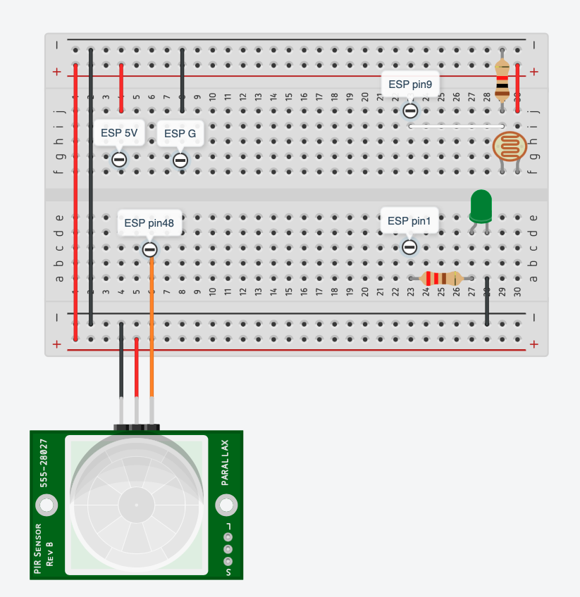
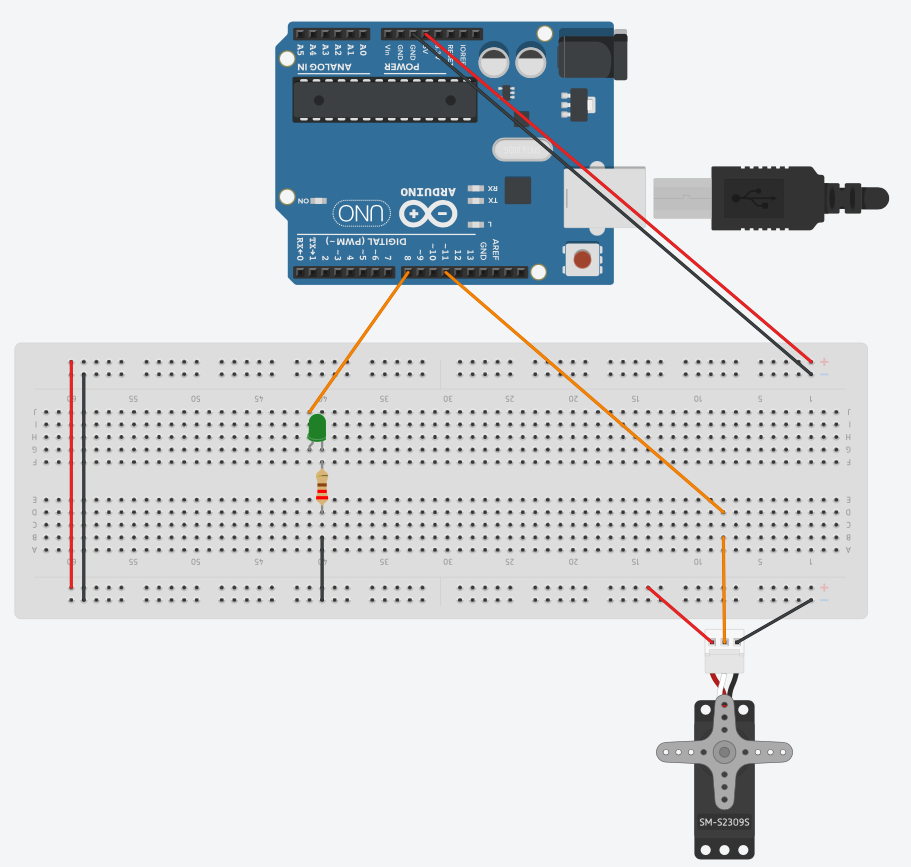
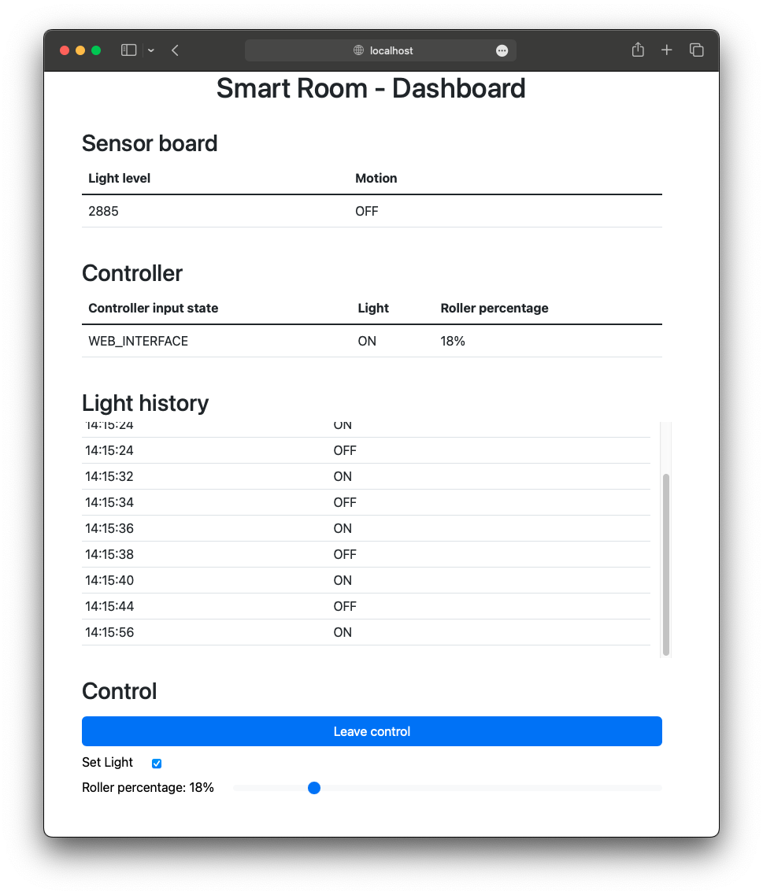
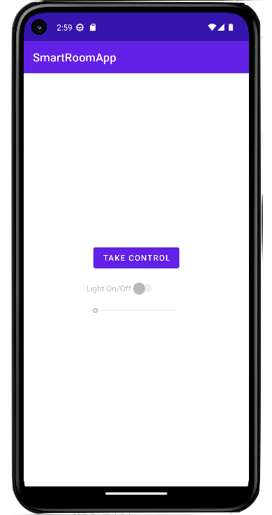

# Smart-Room

## Progetto di sistemi embedded e IOT
[Qui](./Specificaitions.pdf) è possibile trovare le specifiche.

## Assunzioni e scelte progettuali
Si è deciso che l'**App**, in quanto connessa direttamente al **Controller**, abbia la precedenza su qualsia altro sistema di controllo.
Ad esempio infatti se la **Dashboard** ha il controllo questo può essere sottratto dall'**App** mentre non è invece possibile il contrario.

## Progettazione
Per prima cosa si sono progettati il la **Room Sensor Board** e il **Room Controller**.

### Room Sensor Board

La **Room Sensor Board** è composta da tre sottosistemi:
- Sampling Subsystem: si occupa di raccogliere i dati dai sensori e li mette a disposizione degli altri sottosistemi.
- Led Subsystem: si occupa di accendere e spegnere il led che indica la rilevazione del movimento nella stanza.
- Service Subsystem: si occupa di mandare in continuazione i dati dei sensori al **Room Service**

### Room Controller

Il **Room Controller** è composto da tre sottosistemi:
- Light Subsystem: si occupa di accendere e spegnere la luce della stanza.
- Roller Subsystem: si occupa di svolgere o avvolgere le tapparelle.
- Input Subsystem: si occupa di raccogliere l'input dal **Room Service** o dalla **Room App**.

#### Input Subsystem
Questo è il sottosistema più complesso e di seguito si spiegano alcune scelte progettuali.

Sebbene a dare l'input possano essere tre entità (**Room Service**, **Dashboard** e **App**) in realtà, in quanto la **Dashboard** non comunica direttamente con il **Controller** ma solo con il **Service**, vengono distinti solamente due stati (*Service* e *Bluetooth*). 

Quando si trova nello stato *bluetooth* il **Controller** aggiorna periodicamente il **Service** in maniera da poter mantenere aggiornata la **Dashboard**. Per eventuali miglioramenti futuri sarebbe fattibile anche aggiornare periodicamente l'**App** quando il **Controller** prende l'input dal **Service**, ma non è altrettanto necessario in quanto, come da specifica, non è richiesto che l'**App** monitori lo stato della stanza.

     Note sull'implementazione dell'Input Subsystem  

Siccome i periodi del **Controller** potrebbero essere modificati, e quindi potrebbero diventare addirittura più lunghi dell'invio degli input da parte del **Service** o dell'**App**, e siccome il **Service** e l'**App** potrebbero inviare messaggi in maniera molto ravvicinata si è deciso di permettere l'accumulo dei messaggi di input.

Accumulare i messaggi rende però necessario memorizzarne la sorgente, si è scelto quindi di utilizzare un unico formato di messaggi di input sia dal **Service** che dall'**App** che è il seguente.

\<InputChangeFlag\>;\<InputSource\>;\<Light\>;\<RollerPercentage\>

*InputChangeFlag* serve ad indicare il cambio di sorgente di input, è un intero e può assumere i seguenti valori:
- NO_CHANGE = 0 (la sorgente non cambia)
- BT_CONN = 1 (la sorgente diventa il bluetooth)
- BT_DISC = 2 (la sorgente torna ad essere il **Service**)

*InputSource* è un intero e può assumere i seguenti valori:
- SERVICE = 0
- BLUETOOTH = 1

*Light* e *RollerPercentage* sono interi e indicano se accendere o meno la luce e la percentuale di apertura delle tapparelle.

Questi messaggi, in caso si accumulo, vengono processati in un unico ciclo dell'**Input Subsystem** ma in modo da tenere consistente lo stato del controller, come se i messaggi fossero stati processati uno per ogni ciclo.

Il motivo per cui non è possibile utilizzare semplicemente solo l'ultimo input è evidente con il seguente esempio:
>
>Si ipotizzi l'accumulo dei seguenti messaggi (a sinistra i più vecchi)
>
>0;0;x;xxx : 1;1;x;xxx : 0;0;x;xxx
>
>Il primo messaggio viene dal **Service**.
>
>Il secondo messaggio viene dall'**App** e indica il cambio di input a *BLUETOOTH*
>
>Il terzo messaggio viene dal **Service** che ancora non sa che l'**App** ha preso il controllo.
>
>Se prendessimo in considerazione solo l'ultimo messaggio avremmo sostanzialmente ignorato il cambio di input.

Si noti infine che essendo il seriale l'unico canale di comunicazione su cui devono passare sia i messaggi del **Service** che quelli provenienti dal bluetooth sono possibili delle collisioni.

Per semplicità l'unica contromisura a questo problema è stata quella di tenere i messaggi più corti possibile in modo da ridurre la probabilità di collisione.
Eventualmente sarebbe possibile decidere una lunghezza fissa dei messaggi (in caso di messaggi più brevi inserire un padding) in questo modo se due messaggi dovessero collidere ci si potrebbe rendere conto della collisione e scartare i dati ricevuti.

### Room Dashboard

La **Dashboard** è molto basica e tutta la logica viene eseguita nel browser del client.

Essa è divisa in 4 sezioni (dall'alto verso il basso):

1. Sensor board: mostra in tempo reale le rilevazioni del sensore.
1. Controller: mostra in tempo reale lo stato del controller.
1. Light history: come da specifiche mostra lo storico dello stato della lampadina della stanza. Per mantenere alta la precisione ma senza mostrare un grafico troppo confusionario si è deciso di mostrare in forma tabellare tutti i cambi di stato della luce.
1. Control: permette di controllare luce e tapparelle direttamente dalla dashboard.

La **Dashboard** funziona a polling, a intervalli regolari richiede via HTTP al **Service** tutti i dati necessari.

Come detto in precedenza la **Dashboard** non potrà prendere il controllo nel caso in cui a controllare ci fosse già l'**App** e se invece l'**App** dovesse richiedere il controllo mentre questo era dato alla **Dashboard** esso verrà revocato.

#### Note
Durante il primo giorno di avvio del sistema la **Dashboard** a 00:00:00 segnerà la luce in stato *???*. Questo è dovuto al fatto che se il sistema è stato avviato dopo 00:00:00 chiaramente non sarebbe corretto mostrare uno stato *ON* o *OFF*.

### Room App

    
    

Anche l'**App** è stata tenuta volutamente semplice. Essa è infatti composta da un'unica *Activity* che si comporta come la sezione *Control* della **Dashboard**.

Non avendo un dispositivo Android si è sfruttato il componente software fornito a lezione per emulare il comportamento del Bluetooth attraverso la linea seriale.

L'**App** apre la connessione seriale appena viene aperta e non appena si chiude la finestra (anche senza terminare l'applicazione) la connessione viene chiusa.
Grazie ai messaggi di input visti [sopra](#InputSubsystemInput), l'**App** può prendere o lasciare il controllo e settare manualmente luci e tapparelle.

#### Possibili miglioramenti
Non è richiesto dalle specifiche, ma sarebbe utile far sì che il **Controller** informi l'**App** del suo stato corrente (quando non è l'**App** a controllarlo) un po' come fa con il **Service** quando a controllarlo è l'**App**.

Inoltre dato il fatto che l'**App** tenta subito di aprire la connessione seriale appena avviata essa crasha nel caso in cui venga aperta prima di aver avviato il sistema (**Service** e **Controller**).

### Room Service
Il **Service** è la parte centrale di tutto il sistema, è stato realizzato in Java utilizzando il framework Vertx per creare il server HTTP e il client MQTT.

Esso si occupa di mantenere lo storico dei dati del **Controller**, in modo da poterli fornire alla **Dashboard** e soprattuto di governare in maniera automatica (seguendo le specifiche fornite) il **Controller** quando né l'**App** né la **Dashboard** hanno il controllo.

#### Possibili miglioramenti
Il **Service** funziona ma il codice potrebbe essere riscritto in maniera più ordinata e comprensibile.
